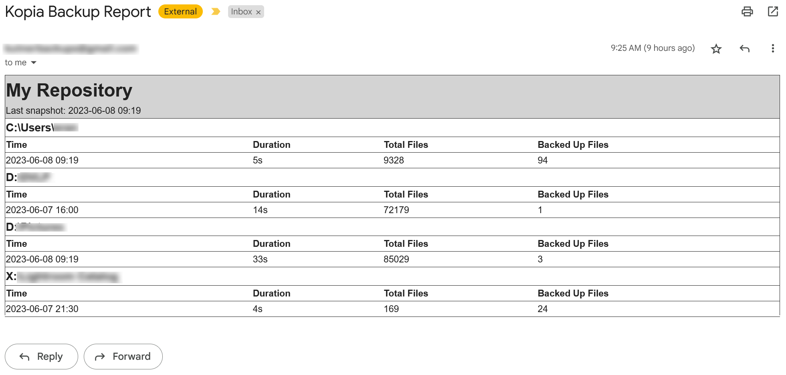
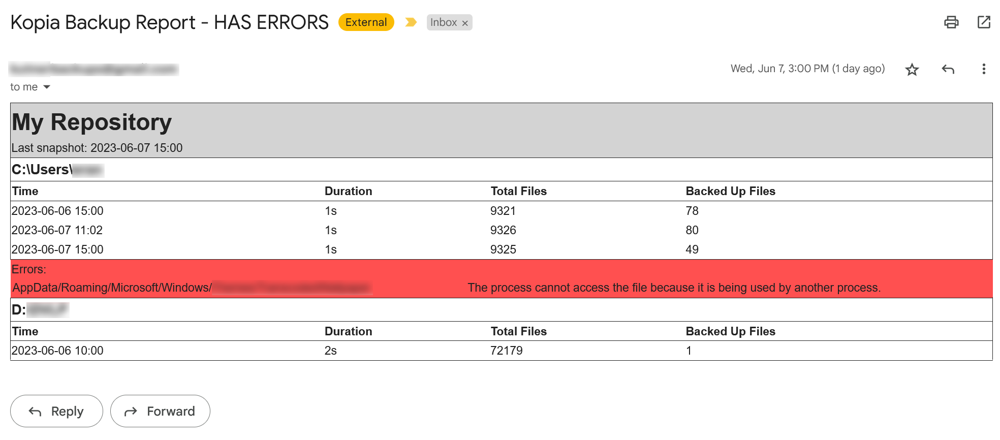

# kopia-mon
kopia-mon is a off-line monitoring and alerting tool for Kopia backup. It is designed to run on a schedule, review all the backup tasks that completed since its previous run, and send an email report with any detected errors.

<u>**Main features:**</u>
* Email based reporting and alerting for kopia backup
* Always send the report or only when errors occur
* Alert on snapshot error
* Alert on snapshot inactivity/ missed backups
* Optionally do a basic verification that there were actually changes that required backup when detecting inactivity
* Optionally set a different email header when errors are detected
* Handles multiple repositories in a single email
* Support for SMTP servers that require authentication like gmail


## Example reports:
A daily report with no errors:


A daily report with an error in one of the snapshots:


A daily report when no snapshot has been taken for too long:


**NOTE:** The program has only been tested with gmail, both for sending and receiving the emails. Other SMTP providers that use TLS should work but there are no guarantees. Likewise, if the recipient is not on gmail, the email formatting may not work correctly and the email may look messed up.

# Setup
The kopia command line must be in the environment path when kopia-mon is
Python with minimum version 3.10 is required. It is recommended to use a virtual environment, if you know how to use it and how to get the scheduler to run the script from the correct environment.

Installing dependencies:
```
pip install -r requirements.txt
```

### Gmail configuration
Since the config file holds a cleartext (=unencrypted) password it is **highly** recommended that you create a dedicated gmail account just for sending emails from kopia-mon. Once you create the account had over to the "Manage Account" panel and select the "Security" tab. Find the "Signing in to Google" section on that page and select "App passwords". Create a new app password and, copy it, and paste in appropriate place in the config file.


# Configuration
## Command line
```python kopia-mon.py```

**Optional arguments:**  
**`-c <CONFIG_FILE>`** - Path to config file. Default: "config.yaml"  
**`--no-send-email`** - Write the report to stdout instead of sending it by email  
**`--set-exit-code`** -  Set the exit code to 0 if no report was generated, 2 if a report was generated and 6 if an error report was generated. An exit code of 1 would indicate a python error, as usual.


## Config file
kopia-mon requires a YAML configuration file with the following structure:

**email:**  
&nbsp;&nbsp; **from:** (required) - Email address of sender  
&nbsp;&nbsp; **to:** (required) - A single email address or array of email addresses to send the report to>  
&nbsp;&nbsp; **_subject:_** (optional) - The subject of the email when there are **_no errors_**  
&nbsp;&nbsp; **_subject-error:_** (optional) - The subject of the email when there **_are errors_**  
&nbsp;&nbsp; **server:**  
&nbsp;&nbsp;&nbsp;&nbsp; **address:** (required) - The address of the SMTP server to use for sending the emails  
&nbsp;&nbsp;&nbsp;&nbsp; **port:** (required) - The port of the SMTP server  
&nbsp;&nbsp;&nbsp;&nbsp; **user:** (required) - The username to authenticate to the SMTP server with  
&nbsp;&nbsp;&nbsp;&nbsp; **password:** (required) - The password to authenticate with  
**repositories:**  
&nbsp;&nbsp; \- **config-file:** (required) - The kopia config file for the repository  
&nbsp;&nbsp;&nbsp;&nbsp; **inactivity_days:** (required) - minimum days of inactivity before reporting an error  
&nbsp;&nbsp;&nbsp;&nbsp; **validate_inactivity:** (required) - Boolean value indicating if kopia-mon should try to verify if there were any actual file changes, that were expected to be backup up but didn't, before reporting an inactivity error. This check ignores ignored files so a change in an ignored file will still trigger the alert  
&nbsp;&nbsp;&nbsp;&nbsp; **errors_only:** (required) - Boolean value indicating if kopia-mon should only send an email when errors are detected or every time it runs  

Example:
```
email:
  from: me@myself.com
  to: me@myself.com
  subject: Kopia Backup Report
  subject-error: Kopia Backup Report - HAS ERRORS
  server:
    address: smtp.gmail.com
    port: 465
    user: me@gmail.com
    password: my_app_password
repositories:
  - config-file: documents.config
    inactivity_days: 2
    validate_inactivity: false
    errors_only: true
  - config-file: media.config
    inactivity_days: 5
    validate_inactivity: true
    errors_only: true
```

## Scheduling
The program doesn't manage scheduling. You should use your OS scheduling service (cron, Windows Task Scheduler, etc.) to run it periodically. Kopia's "After Snapshot" action should also work but it hasn't been tested and unless it's very important to be notified immediately about errors I wouldn't recommend it.

